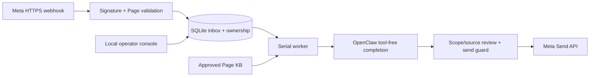

# Hermes Page CSKH — 0.1.0

Standalone CSKH Facebook Page service: Meta webhook → durable SQLite inbox → Hermes
completion adapter → scoped KB → human handoff → guarded Messenger Send API.

**Installer: [START_HERE.md](START_HERE.md).**

## What ships

- Signed GET/POST webhook; Page filtering and deduplication.
- Single-process durable queue; Page+customer history isolation.
- Configured Hermes completion adapter with an exact empty tool surface. History is
  owned by this service's SQLite database, **not a persistent native Hermes session**.
  Optional `hermesHome` creates a dedicated CSKH Hermes runtime home for persona/model
  context only; it is not customer memory.
- Approved JSON knowledge documents, keyword retrieval, expiry checks, source
  validation and a second isolated model review for factual replies.
- BOT / WAITING / HUMAN state, local takeover/resume console and audit history.
- Draft mode by default; live mode probes Page token ownership at startup.
- No blind retries after uncertain sends. Operator reconciliation is required.
- `.env` parsed privately by plugin, not exported globally or placed in agent workspace.
- Setup plan/apply, doctor, verify, operator CLI and portable npm tarball.

## Runtime design



No extra npm runtime dependency: uses Node built-ins including `node:sqlite`.
Hermes integration is launched by `src/service.mjs`; no build transpilation is
required because distributable runtime source is native ESM JavaScript (`.mjs`).

## Local development

```bash
npm run check
npm test
npm pack
```

Hermes standalone compatibility should be proved on the target host with setup, smoke and
acceptance checks before enabling live sends.

## Important boundaries

One Page per Gateway in v0.1. Multiple independent Gateways can install the same
package with separate configs. Do not activate two senders for the same Page.
One serial worker limits throughput intentionally. No attachments/voice processing,
comment-to-DM, CRM integration, automatic notification to Slack/Telegram, or HA cluster.
Handoffs appear in the operator console; staff must monitor it (click refresh).

Semantic checks reduce hallucinations but do not prove correctness. Prompt injection
and false scope classifications require Page-specific adversarial acceptance tests.
The UI is local, token-authenticated, single-operator; it is not a multi-user IAM system.

See [setup](docs/SETUP.md), [operations](docs/OPERATIONS.md),
[security](docs/SECURITY.md), [acceptance](docs/ACCEPTANCE.md),
[migration](docs/MIGRATION.md), [status](docs/STATUS.md).
