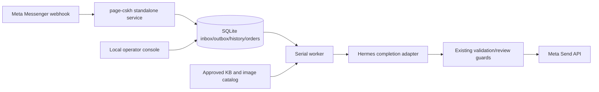

# Hermes migration plan

## Goal

Move `page-cskh` from an OpenClaw plugin to a standalone Page CSKH service that uses Hermes only as the completion runtime. The Page service remains the owner of routing, customer history, queueing, handoff, send guards, and Meta delivery.

## Non-negotiable continuity invariant

Hermes must be stateless per Facebook customer. All durable customer memory, Page/PSID isolation, ownership state, order state, deduplication, outbox status, audit history, and send reconciliation remain in the `page-cskh` SQLite database.

A Hermes session reset, Hermes memory change, or model/provider switch must not erase or mix any Facebook customer conversation. Every model call receives an explicit JSON payload assembled from the SQLite source of truth.

## Target architecture

## Why standalone service first

Hermes webhook subscriptions are useful for generic event-to-agent workflows, but this bot has stricter requirements:

- Meta GET challenge and raw-body HMAC verification.
- Page ID and PSID routing captured by code, never chosen by a model.
- Durable SQLite queue/history and handoff state.
- No automatic retry after ambiguous sends.
- Draft/live send guard.
- Local operator console and reconciliation flow.

Therefore Hermes should provide completion only; it should not own the Meta webhook endpoint or customer session state in phase 1.

## Migration phases

### Phase 0 — Baseline

- Create migration branch.
- Preserve current dirty worktree on that branch.
- Confirm current tests pass before behavior changes.

### Phase 1 — Standalone entry

- Add `src/service.mjs` for standalone lifecycle.
- Keep existing `src/index.mjs` as legacy OpenClaw entry until docs/scripts no longer depend on it.
- Service responsibilities:
  - load config and private env file;
  - validate KB;
  - create `Store`, `Worker`, Meta client, notifier, admin console, webhook server;
  - start/stop cleanly;
  - expose a loopback health endpoint if needed by verify scripts.

### Phase 2 — Hermes completion bridge

- Add a completion adapter with the same interface used by `Worker`:
  - input: `{ agentId, message, system, signal, timeoutMs }`
  - output: model text
- The adapter must not pass Meta secrets, admin token, recipient choice, tool access, or process env dumps to Hermes.
- The adapter must disable/avoid Hermes persistent memory and context files for customer calls.
- The service remains responsible for building model payloads from SQLite history.
- Optional `hermesHome` / `PAGE_CSKH_HERMES_HOME` creates a dedicated Hermes runtime home for the CSKH completion persona. This home is for model/provider/runtime context only; it is not customer memory and must never contain Meta secrets, PSIDs, orders, or customer messages.

### Phase 3 — Setup and deployment

- Replace OpenClaw setup calls with Hermes/service checks.
- Runtime files stay outside repository:
  - config JSON;
  - `.env` mode 600;
  - SQLite database;
  - KB and image catalog;
  - agent workspace if needed.
- Provide systemd user service or equivalent documented start command.
- Default remains `mode: draft`.

### Phase 4 — Verification

Required before live:

- `npm run check`
- `npm test`
- standalone service smoke test in draft mode
- Meta GET challenge through public HTTPS tunnel
- signed POST writes inbound message and creates draft outbox
- admin takeover/resume still works
- OpenClaw-to-Hermes DB continuity test passes
- live mode only after human approval

## Conversation continuity acceptance tests

The migration is not accepted unless these behaviors are covered by automated or smoke tests:

1. A stopped OpenClaw-era runtime database can be opened by the standalone service without losing customer history.
2. A pending customer message queued before restart is processed after restart.
3. HUMAN, WAITING, BOT, order collection, and ready-order notification state survive restart.
4. Two customers talking concurrently never share history or recipient IDs.
5. A newer customer message cancels stale model output.
6. A takeover while Hermes is running cancels late bot output.
7. Hermes timeout/error does not delete inbound messages.
8. Ambiguous send remains `unknown` and requires operator reconciliation; it is never auto-retried.

## Operational cutover runbook

1. Keep old runtime in `draft` or stop it before starting live Hermes service.
2. Stop old DB writer.
3. Backup SQLite with a consistent backup or WAL checkpoint; do not copy only the main `.sqlite` file while the writer is running.
4. Start standalone service in `draft` with the copied DB/config/KB.
5. Verify admin console and draft outbox for a real Page message.
6. Switch public webhook routing only after old sender is stopped.
7. Enable `live` only after approval and acceptance tests.
8. Keep rollback artifact and DB backup until production traffic is stable.

## Rollback

- Stop standalone service.
- Restore previous reviewed package/service.
- Restore compatible config/DB if schema changed.
- Start in draft and verify before live.

Current schema remains v1 at the start of migration; unknown schemas must fail closed.
